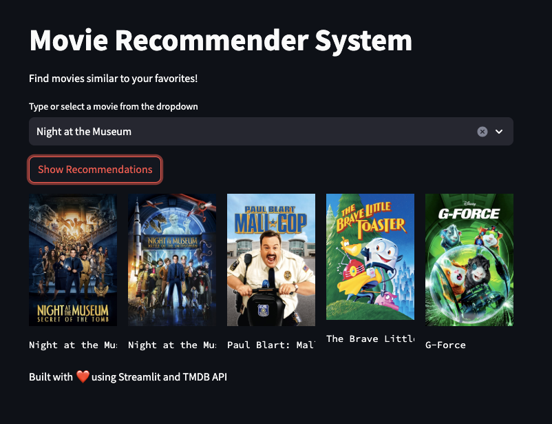

# Movie Recommender System Project
A content based movie recommender system using cosine similarity based on [TMBD dataset from Kaggle](https://www.kaggle.com/datasets/tmdb/tmdb-movie-metadata).



This project aims to recommend the different movies based on given input by using machine learning techniques, specifically the cosine_similarity. The model is trained on a dataset containing various features of movie tmdb dataset, such as 'movie_id','title','overview','genres','keywords','cast','crew' and other relevant factors.

## Dataset

The [Kaggle dataset](https://www.kaggle.com/datasets/tmdb/tmdb-movie-metadata) used for this project consists of a collection of all the hollywood movie, each with associated features and the corresponding cast and crew. The dataset is preprocessed to handle missing values, categorical variables, and feature scaling, ensuring the data is suitable for training the recommendation model.

It contains two files that you'll need to download and use for this project:
- `tmdb_5000_credits.csv`
- `tmdb_5000_movies.csv`

## Algorithm

Based on Content-based filtering uses item features to recommend other items similar to what the user likes, based on their previous actions or explicit feedback.

Cosine Similarity: It calculates the Cosine Similarity between the two non-zero vectors. A vector is a single dimesingle-dimensional signal NumPy array. Cosine similarity is a measure of similarity, often used to measure document similarity in text analysis.

ast: It is Abstract Syntax Tree. It contains ast.literal_eval() function. It is used to evaluate trees of the Python abstract syntax grammar. Abstract syntax changes with each python release. Custom parsers are one use case of ast.literal_eval() function.

PorterStemmer: It is used to determine domain vocabularies in domain analysis. Stemming is desirable as it may reduce redundancy as most of the time the word stem and their inflected/derived words mean the same.

## Setup

Clone the project:
```shell
git clone git@github.com:Monte9/tmbd-movie-recs-python-machine-learning.git
cd tmbd-movie-recs-python-machine-learning
```

Install the dependencies:
```shell
pip install -r requirements.txt
```

Download the [dataset from Kaggle here](https://www.kaggle.com/datasets/tmdb/tmdb-movie-metadata).
Move the files to the root folder:
```
\
- tmdb_5000_credits.csv
- tmdb_5000_movies.csv
```

## Usage

Run the Streamlit app to first generate the movie list & similarity models:
```shell
streamlit run app.py
```

Output:
```

Starting movie recommendation model creation...
Loading datasets...
Merging movie and credits data...
Processing features...
Creating combined features...
Calculating similarity matrix...
Saving processed data...
Successfully saved movie_list.pkl
Successfully saved similarity.pkl

Model creation completed!
Total movies processed: 4809
```

Then run the Streamlit app to get movie recommendations:
```shell
streamlit run app.py
```

Open your browser and go to http://localhost:8501/ to access the movie recommendation app.

## Credits

This project was inspired (forked) from [Amazing-Python-Scripts/Movie recommendation system](https://github.com/avinashkranjan/Amazing-Python-Scripts/blob/main/Movie%20recommendation%20system) and credit to the author [kanishkasah20](https://github.com/kanishkasah20). I improved the code using [Claude](https://claude.ai/).
